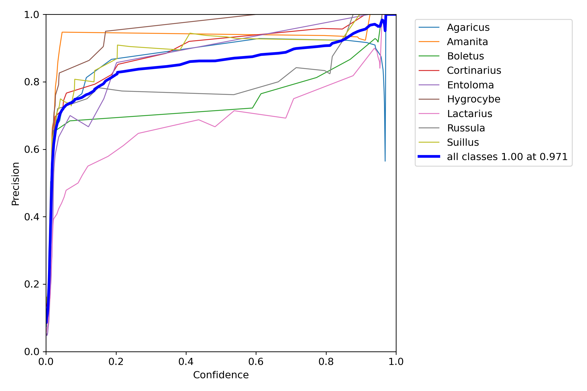

<h1 align="center">Is mushroom poisonus?
</h1>

<strong>Identify mushrooms are poisonus or not</strong>

 

  WIP: Mushroom types OpenCV object-detection, Poisonus YOLOv5 object-detection, APP, etc.

 

  <strong>Mushroom types YOLOv5 object-detection results:</strong>
  
  
  
  
  
  
  
  
  
  
  

## Using Machine:
OS: Arch Linux x86_64, 5.15 zen kernel

CPU: Intel i5-8300H (8) @ 4.000GHz

GPU: NVIDIA GeForce GTX 1050 Mobile w/ CUDA

## Credit:
https://github.com/hbfawaz112/Mushroom-Detector-Flutter-ML

https://github.com/ultralytics/yolov5
